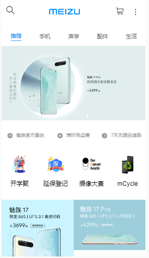
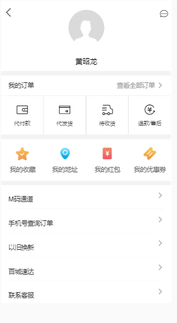
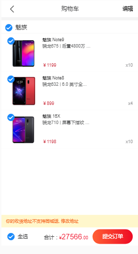
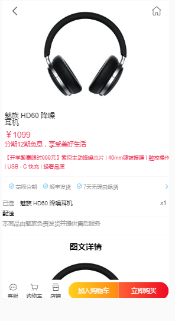
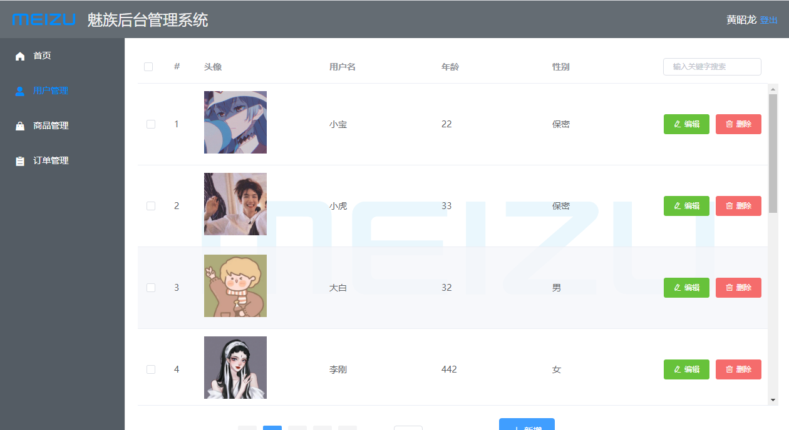

# 项目名称: 魅族App
## 演示
	* 官网：https://m.meizu.com/index.html
	* 上线网址
		* 后端：
		* 后台管理系统：
		* webapp：
## git仓库地址: https://github.com/gzh52003/meizu-WebApp

## 团队与分工
	* 组长：黄昭龙，成员：张佳豪,黎立坤,宋永基
		
	* 负责模块说明
		* 黄昭龙
			* 负责购物流程的实现
			* 后端接口
			* 管理系统商品列表的展示、编辑、修改、分类等功能
			* webApp手机模块静态页面和跳转详情页的编写
			* 爬取数据
			* 协调工作
		* 张佳豪
			* 管理系统用户列表展示、编辑、修改等功能的编写
			* webApp声学模块静态页面和跳转详情页的编写
			* 用户订单页面
		* 黎立坤
			* webApp配件模块静态页面和跳转详情页的编写
			* 详情页功能编写
			*完善购物车功能
		* 宋永基
			* webApp生活模块静态页面和跳转详情页的编写
			* 登陆注册功能的实现
			* 订单页登陆才能查看业务编写
## 项目页面截图（3-5张）
	
	
	
	
	

## 项目目录说明

├─api		后台服务器目录
│  └─src
│      ├─filter		跨域允许配置
│      ├─public		服务器静态资源
│      │  ├─images	
│      │  └─uploads	图片上传所存目录
│      ├─router		接口文件
│	   └─utils		工具包
│   
├─express	后台管理系统项目
│  ├─public		网站根目录
│  │  └─images
│  └─src
│      ├─router		路由配置
│      ├─utils		工具包
│      └─views		页面
│          ├─goods	
│          ├─home
│          ├─order
│          └─user
│
│
└─webAPP		webApp项目
    ├─public	网站根目录
    │  └─images
    └─src
        ├─assets	静态资源	
        ├─router	路由配置
		├─store		vuex
        ├─utils		工具包
        └─views		页面